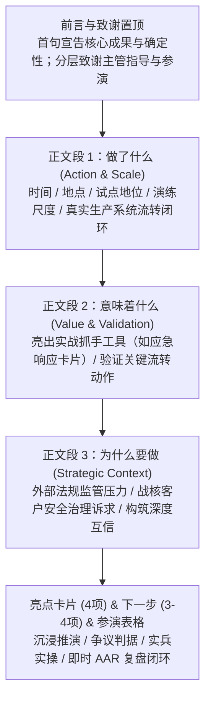

# 商务与高管简报邮件风格指南 (Executive Briefing & Business Email Style Guide)

> 适用范围：面向领导层、跨组织决策者、代表处管理层或关键利益相关方的成果简报、演练通报与合规汇报。  
> 核心原则：**平实、客观、中立的商务语感；事实做功；杜绝 AI 套话 (no-ai-slop)；高保真高兼容。**  
> 来源归属：源自 2026-09-11 法国 CRA Article 14 实战演练成果简报实战经验沉淀。

---

## 1. 结构规范：正文恰好三段论 (Three-Paragraph Executive Body Rule)

高管与决策者的注意力极其有限。在顶端致谢与背景交代后，正文必须在 30 秒内完整交付决策上下文，严格遵循“**做了什么 → 意味着什么 → 为什么要做**”的逻辑链：

### 段落展开细则

| 板块 | 核心目标 | 必备要素 | 禁忌 |
|---|---|---|---|
| **前言与致谢 (置顶)** | 宣告成果确定性，分层致谢支持者 | 1. 简短宣告核心合规/业务事件顺利跑通。 2. 分层致谢：先管理层（明确指导、跨部门资源协同、直接参演），再执行团队（一线团队实操投入、跨部门专家协同）。 | 杜绝“大力支持”、“高度重视”、“圆满成功”等空洞主观形容词。 |
| **正文段 1：做了什么** | 交代规模、尺度与全流程动作 | 1. 明确时间、地点、首创/试点地位。 2. 明确尺度（如 1.5 小时、三幕敏捷推演）。 3. 动词串联业务全闭环（如 接障开单 → 管理会议决策 → 安全事件升级 → 研发接管调查 → 首封通报分发）。 | 杜绝清嗓铺垫（“众所周知”、“值得一提的是”），首句直接给事实。 |
| **正文段 2：意味着什么** | 亮出管理抓手与实战做功证据 | 1. 检验了具体落地工具（如一页纸“应急响应卡片”）。 2. 验证了制度到人头、卡片到桌面、跨部门联动有效。 | 杜绝空谈“极大提升了应急能力”、“上了一个新台阶”。 |
| **正文段 3：为什么要做** | 拔高维度，回答业务战略关切 | 1. 外部监管驱动（如法规强制上报生效）。 2. 内部业务护航（覆盖电信运营商及战略核心客户）。 3. 战略终局落脚点（“与关键客户在安全治理上构筑深度互信”）。 | 杜绝脱离业务的口号宣誓；必须落到客户信任与商业底线。 |

---

## 2. 语言哲学：用“事实性重构”代替套话 (Factual Reconstruction)

面向领导层的汇报天然需要体现管理层的重视与支持，但若采用传统公文套话，会显得虚浮且充斥强烈 AI 味。**破解之道是用具体动作、参演事实与资源协调替代抽象形容词。**

### 典型对比表

| 场景 | ❌ 传统公文套话 (Slop) | ❌ 纯冷冰技术日志 | ✅ 事实性重构 (商务风标准) |
|---|---|---|---|
| **致谢领导** | 在代表处领导的高度重视和全力支持下，演练取得了圆满成功。 | 演练于 9 月 11 日完成，各级领导出席。 | 在极紧的筹备窗口下，法国代表处各位主管给予了明确指导、资源协同与直接参演，为推演提供了关键支撑。 |
| **业务价值** | 本次演练具有里程碑式的重要意义，充分体现了我司卓越的安全保障能力。 | 演练涵盖 4 个环节，输出 1 份通报。 | 演练在真实业务环境中，检验了针对该合规要求专门设计的应急卡片，四个关键动作跑通了真实业务流验证。 |
| **客户战略** | 展现了过硬的实力，有力保障了客户业务的安全稳定运行。 | 演练模拟了客户 A 的故障场景。 | 针对电信运营商及战略核心客户对合规事件透明度的高度关注，以可验证的突发响应构筑深度互信。 |

---

## 3. 亮点提炼心法：从“形式展示”升华到“业务战力”

商务邮件中的“亮点/Highlights”不应是流水账，而应突出**对抗性、实战性与组织的快速演进能力**。推荐采用以下 4 项结构化模型：

1. **沉浸式情境驱动**：使用真实系统大屏故障影片/情境推进，打破纸面宣贯，营造真实业务受损的高压推演氛围。
2. **聚焦关键争议判据研判**：不回避模糊地带，主动设置边界案例对抗推演（例如“是否达到上报监管的门槛”），打磨一线指挥官的判定尺度。
3. **真实生产业务流实兵实操（仗怎么打，兵就怎么练）**：强调全程在真实生产支撑系统中实操开单、流转、派单与上报，拒绝演戏式背台词。
4. **即时执行事后复盘 (AAR) 与持续迭代**：推演结束后第一时间在现场开展 AAR（After-Action Review），当场提取实战教训（Lessons Learned），直接闭环到流程优化中。

---

## 4. 反 AI 空话 (no-ai-slop) 自查红线

在起草与修改交付邮件时，强制执行以下红线自查：

- [ ] **中英文情绪词清零**：严禁出现“必须、绝对、坚决、强烈、彻底、圆满、极大、大力、全力、里程碑、深刻、充分体现”；英文对应严禁“must, absolutely, completely, fully, greatly, transformative, robust, elevate, delve, leverage, strictly”。
- [ ] **破折号清零或极少化**：短文案中尽量不使用破折号（$\le 2$ 处，推荐 0 处）；改用清晰的逗号、句号或括号。破折号常代表作者思路懒惰、硬塞补充修饰。
- [ ] **杜绝二元对比句式**：严禁出现“不是……而是……”、“不仅是……更是……”等戏剧化句式，直接陈述后者事实。
- [ ] **清除假解释分词尾巴**：严禁在句尾挂 `-ing` 短语（如 `highlighting...`, `demonstrating...`）或中文“彰显了……”、“有力体现了……”。让主干谓语动词直接做功。
- [ ] **淘汰内部非标俚语**：将组织内部口语或易引起误解的非标词汇，规范化为标准商务制度用语（例如将“会商/升交”规范为“安全研判与管理会议/安全事件升级”）。

---

## 5. 双语与邮件工程安全铁律 (Bilingual & Technical Safety)

1. **双语完全分段排布**：
   - 严禁段内中英文交替混排（视觉混乱、阅读阻力大）。
   - 采用“中文完整版 + 英文完整版”纵向排列，并在顶部/底部提供 `#en` 与 `#cn` 锚点互跳。
   - 英文版不是生硬直译，而是同一事实的等价商务英文重构，核心技术术语严格对齐母本标准。
2. **纯 Table 架构与全内联 CSS**：
   - 邮件安全客户端（尤其是各代 Outlook 与 Exchange）不支持 CSS Grid 与 Flexbox。必须纯嵌套 `<table>` 布局。
   - 彻底杜绝 `<style>`、`<link>`、`<script>` 标签与任何外部 Web 字体 CDN。
3. **废弃 1px Spacer，统一采用 Padding**：
   - 严禁使用 `height: 1px; font-size: 1px;` 的表格行充当空白占位符（高分屏与暗黑模式下会被智能拉伸出白缝且违反字号规则）。
   - 间距完全通过单元格内联 `padding` 控制，全篇正文与注释字号严格 $\ge 14\text{px}$。
4. **外部素材双重审计验真**：
   - 邮件引用的图片资产一律走高可用 HTTPS 直链（如 Cloudflare R2）。
   - 发送前必须执行自动化 HEAD/GET 状态 200 验证，并比对本地源文件与远端资产的 SHA-256 哈希值，确保 100% 一致。

---

## 6. 反“白板邮件”外发门禁与渲染规范 (Anti-Plaintext Pre-Dispatch Gate)

在将 Markdown 报告、简报转换为最终邮件发送时，必须通过以下“反白板邮件”验收门禁：

1. **白板特征即时阻断**：
   - 检查邮件正文是否含有未解析的 `#`、`##`、`**`、`*`、`---`、`>`、`- `、`|---|`；若有，一律判定为不合格，严禁直接调用发送工具。
2. **品牌化视觉容器标配**：
   - 顶部必须有 6px 品牌主色带（CSTC × EU-RSPO 为 `#A50C0B`）；
   - 必须具备分类徽标（Badge）与双语或主副标题区隔；
   - 核心摘要必须采用 4px 左重音边框的 Highlight Card，让关键结论在第一屏脱颖而出；
   - 正文分区必须采用独立卡片容器（背景 `#f8fafc`，边框 `1px solid #e2e8f0`），杜绝大段无区隔白底黑字。
3. **工程化资产落地**：
   - 邮件 HTML 文件必须同名保存在报告所属权威目录或对应 `emails/` 目录下；
   - 作为可长期复用的历史资产参与版本追踪与归档。
